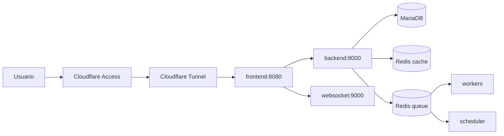

# Diagrama de arquitectura

```mermaid
flowchart LR
  U[Usuario] --> CA[Cloudflare Access]
  CA --> CT[Cloudflare Tunnel]
  CT --> FE[frontend:8080]
  FE --> BE[backend:8000]
  FE --> WS[websocket:9000]
  BE --> DB[(MariaDB)]
  BE --> C[(Redis cache)]
  BE --> R[(Redis queue)]
  R --> WK[workers]
  R --> SCH[scheduler]
```

